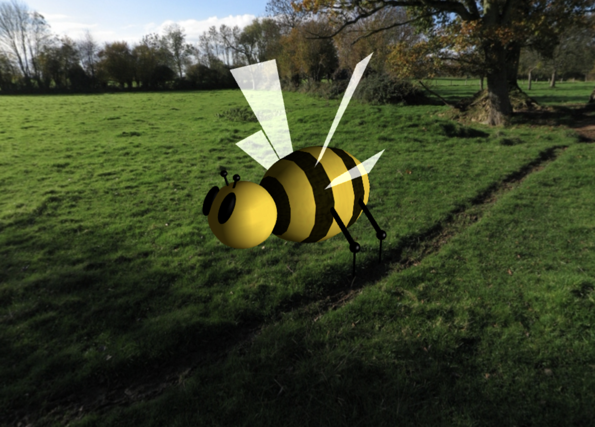
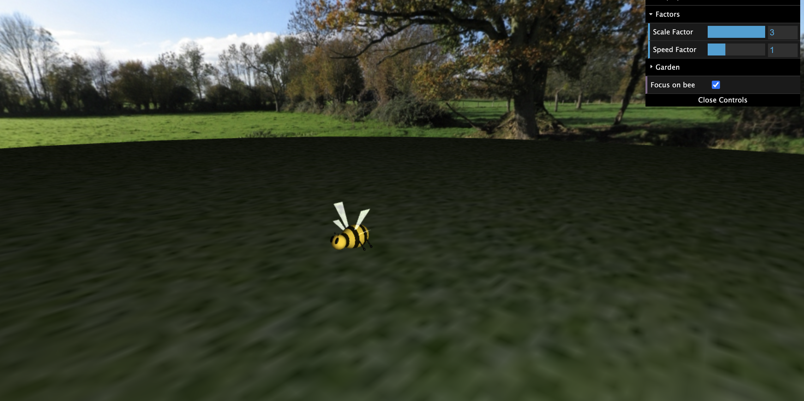
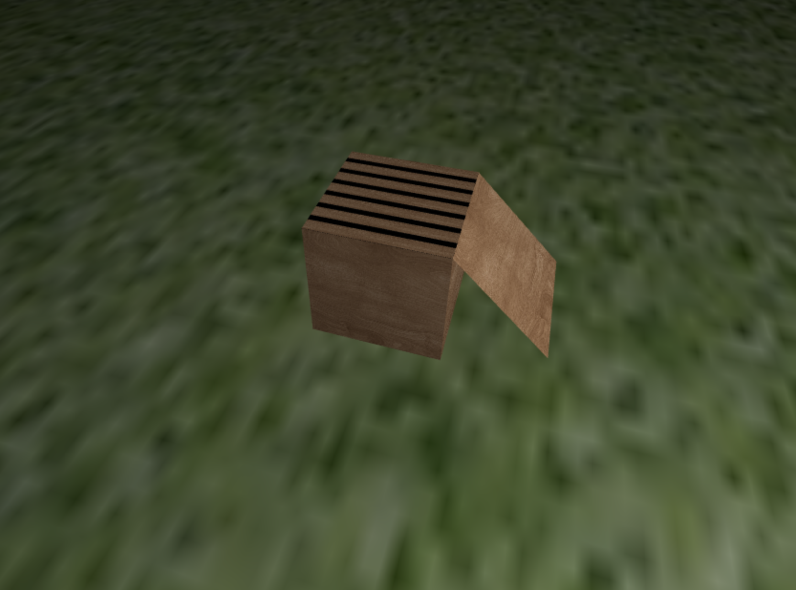
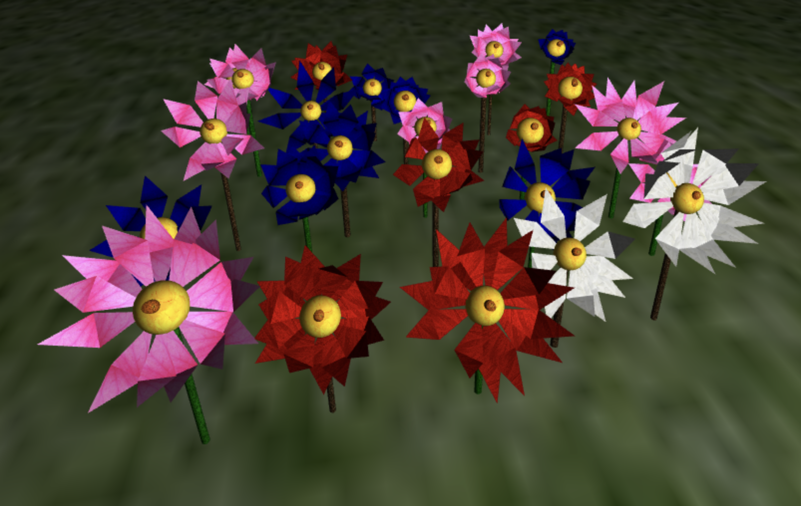
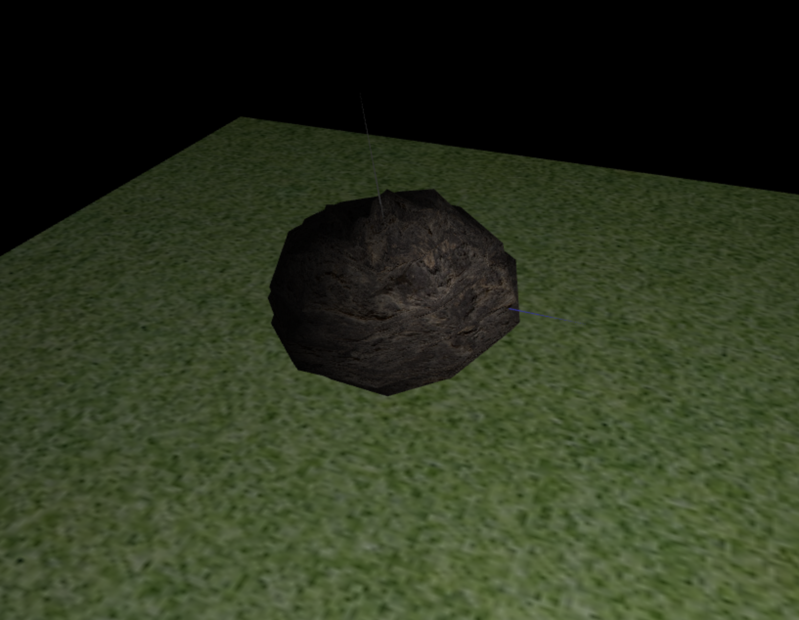
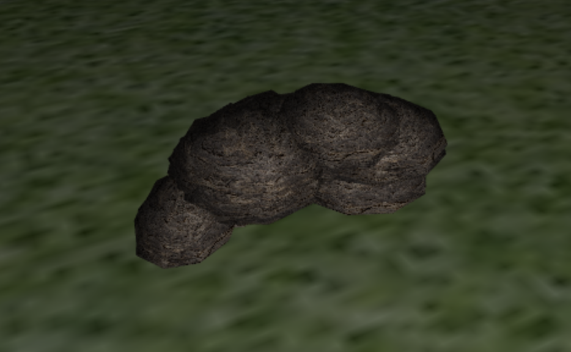
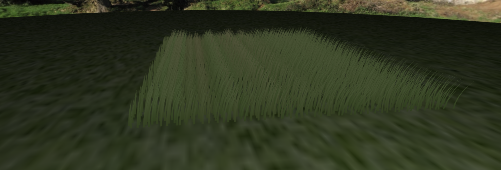
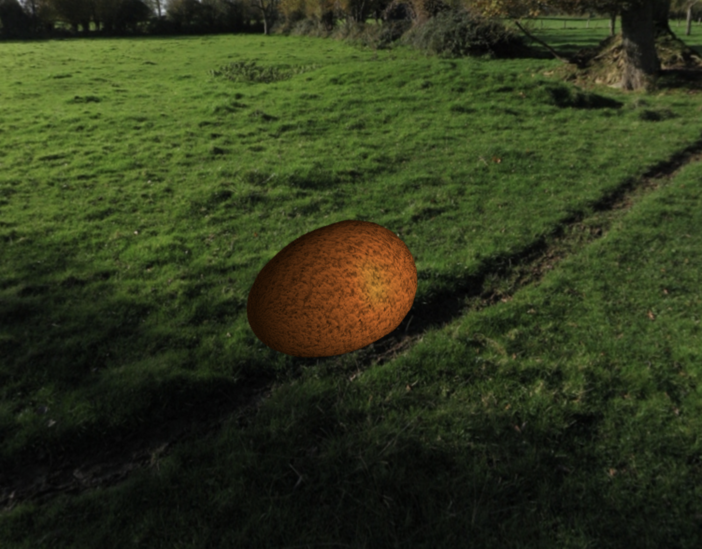

# Computer Graphics

## Bee's Environment

A computer graphics project that creates a scene where a bee collects pollen from flowers and transports it to its hive. All elements were created from scratch using basic geometry, geometry transformations, lighting, textures, and shaders

To watch a demo video, click [here](demo.mp4)

### Screenshots

- Big bee:

- Small bee:

- Hive:

- Flowers:

- Rock:

- Rock set:

- Grass:

- Pollen:

- Environment:
